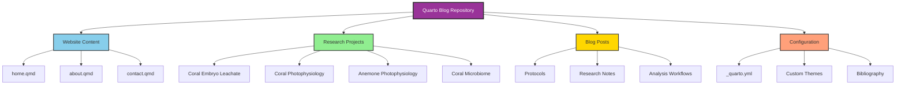

# Sarah Tanja's Open Lab Notebook

This is a Quarto-based website serving as an open lab notebook for research on marine biology, plastic pollution, and climate impacts on coastal primary producers.

## Overview

This repository contains the source code for [Sarah Tanja's Open Lab Notebook](https://sarahtanja.github.io/quarto-blog/), built with [Quarto](https://quarto.org/).

## Repository Structure

## Research Focus

The research documented in this lab notebook explores:

- 🌊 Multiple stressor impacts of microplastic-associated pollution and heat stress on coastal primary producers
- 🪸 Effects on scleractinian corals, sea anemones, kelps, and seaweeds
- 🧬 Microbiome alterations and gene expression changes
- 🔬 Photosynthetic efficiency in marine organisms

**Central Question:** *"Does pollution undermine climate resilience?"*

## Building the Site

This is a Quarto website. To build it locally:

1. Install [Quarto](https://quarto.org/docs/get-started/)
2. Clone this repository
3. Run `quarto preview` to preview locally
4. Run `quarto render` to build the site

## Links

- 🌐 **Live Site:** https://sarahtanja.github.io/quarto-blog/
- 💼 **LinkedIn:** [Sarah Tanja](https://www.linkedin.com/in/sarah-tanja-595722146/)
- 🐙 **GitHub:** [@sarahtanja](https://github.com/sarahtanja)

## License

This work is shared as part of an open lab notebook approach to transparent research communication.
