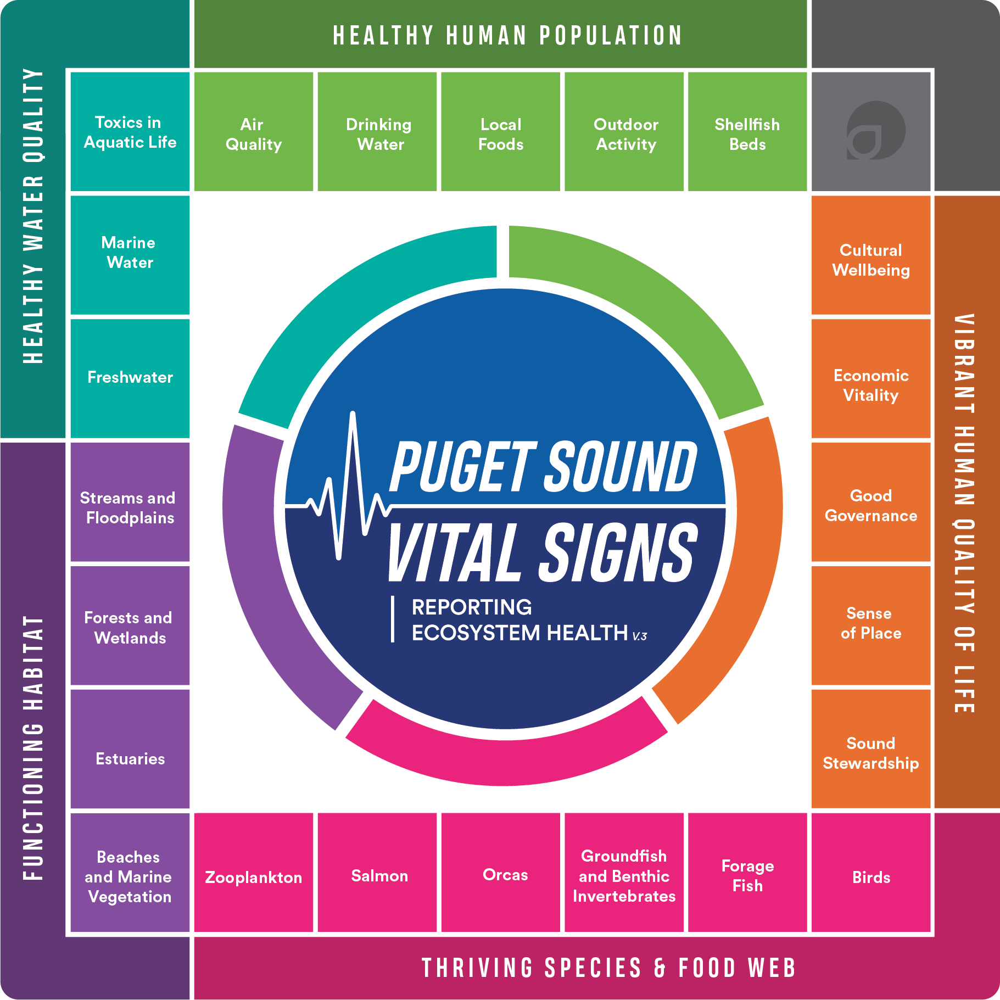

Kelp and eelgrass meadows are nearshore habitats that provide physical complexity (aka places to lay eggs and hide from predators) in temperate marine waters. They're also important for their roles as primary producers (fueling the food chain from the bottom up), producing the oxygen that fish (and humans!) breathe (through the [magic of photosynthesis](https://sarahtanja.github.io/quarto-blog/posts/projects/anemone/photosynth-pam/photosynth-pam.html)), and aid in carbon storage (by producing biomass that stays put). For these reasons, they are critical habitats that are protected by laws[^1].

[^1]: This is a new foray for me into the policy world. I still have a lot of questions about the differences between laws, statutes, policies, regulations, etc. and a lot to learn about how these impact our actions... This footnote is a little bookmark for myself to come back and explore this further

::: callout-note
This post describes the governments, agencies, jurisdiction, and policies that manage critical marine vegetation ✨🌊🌿✨(kelp and eelgrass) habitat in the Puget Sound. The aim is to highlight the **players (who)**, their **roles (what)**, and their management **tools (how)** for protecting and restoring marine vegetation.
:::

The Puget Sound forms the southern reaches of the Salish Sea, which is a larger bioregion encompassing the inland marine waterways of British Columbia and Washington State. The Puget Sound is a fjord-formed estuary, a place where freshwater from rivers mixes with saltwater from the ocean in marshy tidelands, deep ravines, and rocky points.

{fig-align="center"}

## Sovereign Tribal Governments

> Prior to European contact, tribes governed their own affairs, and continue to do so today. Tribes have a sovereign right to govern their members and manage their lands and resources.
>
> The United States recognized tribes as sovereign nations and the rightful owners of the land through the signing of treaties that carry the weight of the U.S. Constitution. Tribal sovereignty is further recognized with the government-to-government relationship that the tribes have with the federal government.

For more information, explore the [Northwest Indian Fisheries Commission](https://nwifc.org/member-tribes/treaties/) webpages and read [Understanding Tribal Treaty Rights in Western Washington](https://nwifc.org/w/wp-content/uploads/downloads/2014/10/understanding-treaty-rights-final.pdf).

<object data="understanding-treaty-rights.pdf" type="application/pdf" width="100%" height="500px">

Unable to display PDF file. <a href="understanding-treaty-rights.pdf">Download</a> instead.

</object>

::: callout-warning
From 1889 to 1971 individuals could purchase tidelands or shorelands from the State of Washington. Because of this, 70% of tidelands (submerged lands from Ordinary High Tide to Extreme Low Tide) in Washington are privately owned.

Because of Tribal treaties (signed prior, from 1854 - 1856) , tribal members can come onto private property to harvest shellfish, finfish, and kelp!

Fifteen western Washington tribes can access private tidelands for harvest: Jamestown S’Klallam, Lower Elwha Klallam, Lummi, Makah, Muckleshoot, Nisqually, Nooksack, Port Gamble S’Klallam, Puyallup, Skokomish, Squaxin Island, Suquamish, Swinomish, Tulalip, and Upper Skagit.

Each tribe has a “usual and accustomed” harvest area (U&A) that reflects the historical region in which finfish, shellfish, and other natural resources ✨🌊🌿✨were collected. **All tidelands in Puget Sound are within the usual and accustomed harvest areas of one or more tribe.**
:::

## National Estuary Program

Congress created the [**National Estuary Program**](https://www.epa.gov/nep) **(NEP)** in ***1987*** under section 320 of the Clean Water Act (CWA) and initiated Puget Sound as an Estuary of National Significance in ***1988***. Puget Sound is the 2nd largest estuary in the U.S (after Chesapeake Bay).

::: callout-note
**player:** The National Estuary Program

**roles:** Provides funding💰, guidance, and technical assistance to the local protection and restoration of Puget Sound. They are the administrative gatekeepers of the EPA grant money, a budget that is designated via Congress and the Clean Water Act.
:::

The Environmental Protection Agency **(EPA)** hosts the **NEP** and the [Puget Sound Recovery National Program Office](https://www.epa.gov/puget-sound). The **NEP** is a non-regulatory program, that abides by section 320 of the Clean Water Act, which mandates a **Comprehensive Conservation Management Plan (CCMP)** be developed and implemented to protect and restore water quality and living resources of Puget Sound.

### Puget Sound Recovery National Program Office

Congress established the Puget Sound Recovery National Program Office within the Environmental Protection Agency (EPA) in 2016 to coordinate funding 💰 and grants from the EPA's NEP. This office awards the [grants](https://www.epa.gov/puget-sound/funding-availability-puget-sound-action-agenda-strategic-implementation-leads) that are distributed through Puget Sound Partnership to each Strategic Implementation Lead (SIL). A total of \$120 million divided across the three SILs (1. Habitat, 2. Shellfish, 3. Stormwater) is provided incrementally over a five-year period. Meaning if distributed equally, each SIL would have an annual budget of \$8 million.

## Puget Sound Partnership

In order to protect and restore, we need a plan that everyone[^2] who has regulatory authorities over activities in the Puget Sound can agree to work towards together. That's where Puget Sound Partnership comes in.

[^2]: In Puget Sound 'everyone' involved are called the **Management Conference:** *"Collectively, the governments, organizations, businesses, and individuals engaged in Puget Sound recovery are called the **Management Conference**; which uses a collaborative, consensus-building approach to develop and implement the **Puget Sound Action Agenda**."* Puget Sound Partnership [develops the action agenda with](https://www.psp.wa.gov/2022AAupdate.php#:~:text=HOW%20IS%20THE%20ACTION%20AGENDA%20DEVELOPED%20AND%20UPDATED%3F) 19 federally recognized Tribal governments, 10 Local Integrating Organizations, 4 boards, the public, and subject-matter experts.

The Washington State Legislature created the [**Puget Sound Partnership**](https://www.psp.wa.gov/) in ***2007*** as a state agency assigned to coordinating and leading restoration and protection efforts in Puget Sound. Read more about Puget Sound Partnership's role [here](https://www.psp.wa.gov/nep-overview.php).

::: callout-note
**player:** Puget Sound Partnership

**roles:** Getting everyone together to cooperate and coordinate Puget Sound recovery and protection efforts. Local (aka State) coordinating agency for the EPA's NEP funding💰for Puget Sound. The primary goal of the Puget Sound Partnership is to coordinate a recovery and protection plan for Puget Sound, and they do that primarily through the Puget Sound Action Agenda (basically a prioritized goals list).
:::

### Puget Sound Action Agenda

The Puget Sound Partnership curates the [Puget Sound Action Agenda](https://www.psp.wa.gov/2022AAupdate.php) which is the Management Conference's shared plan for recovery (the master plan!). The **Puget Sound Action Agenda** is re-worked every four years in a cycle meant to continually assess priorities, incorporate the best available science, and respond to the needs, concerns, and guidance of the Management Conference. The **Puget Sound Action Agenda** doubles as the **Comprehensive Conservation Management Plan (CCMP)**, which is a statutory mandate tied to the designation as an Estuary of National Significance and funding 💰 from the **NEP**.

The Action Agenda has topical goals that shift a little with each iteration. The latest Action Agenda 2026-2030 groups the recovery plan into the following broad topical goals:

1.  Healthy Communities

2.  Sustainable Land Use

3.  **Resilient Habitat**

    ---\> **Marine Vegetation!** ✨🌊🌿✨

4.  Clean Water & Harvestable Shellfish

Within the 2026 Puget Sound Action Agenda, the Marine Vegetation Recovery Plan lives under the Resilient Habitats umbrella.

<object data="ActionAgenda2026MarVeg.pdf" type="application/pdf" width="100%" height="500px">

Unable to display PDF file. <a href="ActionAgenda2026MarVeg.pdf">Download</a> instead.

</object>

In the **Puget Sound Action Agenda**, there are distinct plans for achieving specific ecosystem targets, or monitoring indicators. The targets and indicators are each called [Vital Signs](https://vitalsigns.pugetsoundinfo.wa.gov/).

::: callout-note
We can think of the Puget Sound Action Agenda (the master plan!) as a list of prioritized strategies within the broader topical goals that aim at achieving ecosystem targets.
:::

The Vital Signs related to kelp and eelgrass management are:

::: callout-note
While the Puget Sound Action Agenda is the list of prioritized strategies, the Implementation Strategies are the plans for how to make a strategy a reality (aka how to Implement ... the Strategy).
:::

The plans are each called an [Implementation Strategy](http://www.psp.wa.gov/implementation-strategies.php), and

The Implementation Strategy for management of marine vegetation is the [Marine Vegetation Implementation Strategy](https://pugetsoundestuary.wa.gov/2026/04/28/hsil-announces-release-of-marine-vegetation-implementation-strategy/).

These 5 broad topical goals (and their underlying Implementation Strategies) mostly fit into one of three Strategic Initiatives, called the Strategic Initiative Leads.

The three Strategic Initiative Leads are:

1.  Stormwater
2.  **Habitat**
3.  Shellfish

### Habitat Strategic Initiative Lead (HSIL)

The [Habitat Strategic Initiative Lead](https://pugetsoundestuary.wa.gov/habitat-strategic-initiative/)'s role is to put in place strategies that improve the restoration and protection of the rivers, forests, shorelines, estuaries, kelp, and eelgrass meadows that make up Puget Sound.

### Marine Vegetation Implementation Strategy

## Washington Dept. of Fish & Wildlife (WDFW)

The Washington Department of Fish & Wildlife sets the recreational harvest rules for seaweed in the state. WDFW regulates recreational kelp harvesting through [seaweed rules](https://www.eregulations.com/washington/fishing/shellfish-seaweed-species-rules), licenses, and enforcement, as well as supporting research and conservation efforts. The blanket rules for seaweed harvest in Washington are:

- If 16 years or older, you must have a [Shellfish/Seaweed License](https://www.eregulations.com/washington/fishing/license-information#:~:text=Shellfish/Seaweed%20License%3A,a%20Vehicle%20Access%20Pass.)

- Daily limit of 10lbs wet weight per licensee

- It is illegal to harvest seaweed if herring eggs are attached

All State Park beaches are closed to seaweed harvest except from April 16 - May 15 at Fort Flagler, Fort Ebey, and Fort Worden State Parks.

> Seaweed harvesting in State Parks is limited to posted park hours and special State Park rules below:
>
> - Bull kelp must be cut a minimum of 24" above the bulb and short stemmed kelps must be cut a minimum of 12" above the anchor point. The anchor point must be left in place at all times.
>
> - Only a knife or similar instrument may be used to harvest seaweed. Tearing the plant and use of tined instruments such as rakes or forks is prohibited.
>
> - Each harvester must use their own container. Multiple limits may not be combined in the same container.
>
> - Each harvester must use a scale to determine when the harvest limit has been reached. **Drying or partial drying prior to weighing is prohibited.**

Dr. David Trimbach is hosting Kelp Community Workshops (May-Nov 2026) as part of a research project entitled "Enhancing Kelp Protection and Restoration through Community-Based Social Science Research," funded by the Habitat Strategic Initiative Lead.

> **More information is available in the [Shellfish/Species rules](https://www.eregulations.com/washington/fishing/shellfish-seaweed-species-rules) and on WDFW’s [Fishing license types and fees webpage](https://wdfw.wa.gov/licenses/fishing/types-fees).**
>
> Seaweed harvesters should also review the Washington State Department of Health [shellfish safety map](https://fortress.wa.gov/doh/biotoxin/biotoxin.html) for biotoxin- or pollution-related closures and advisories. Water quality conditions change quickly; check the map the day you plan to harvest.

<https://wdfw.wa.gov/newsroom/news-release/wdfw-invites-participation-workshops-kelp-gathering-and-conservation>

<https://wdfw.wa.gov/species-habitats/ecosystems/marine-shorelines/kelp#how-participate>

## Washington Department of Natural Resources (DNR)

All bodies of saltwater in Puget Sound are Washington State inland (estuary) waters. Under the Submerged Lands Act and Article XVII of the Washington State Constitution, the state owns and manages the bedlands, tidelands, shorelands, and waters of all its navigable inland waterways.

[State Owned Aquatic Lands PDF](https://clallamcountywa.gov/DocumentCenter/View/6338/Boundaries-of-State-owned-Aquatic-Lands-PDF)

<object data="StateOwnedAquaticLands.pdf" type="application/pdf" width="100%" height="500px">

Unable to display PDF file. <a href="StateOwnedAquaticLands.pdf">Download</a> instead.

</object>

> DNR manages state [aquatic lands](https://dnr.wa.gov/aquatics) including marine bedlands and [aquatic reserves](https://dnr.wa.gov/aquatic-reserves), as well as kelp protection, [monitoring](https://dnr.wa.gov/aquatics/aquatic-science/nearshore-habitat-program/kelp-monitoring), and restoration programs. DNR approval and permits are required for **commercial** kelp or seaweed harvest and sale, including from **private tidelands.**

## Northwest Straights

## Kelp and Eelgrass risk assessments

The [Distribution of current and future cumulative risk and contribution of threats to eelgrass and canopy kelp in Puget Sound](https://drive.google.com/file/d/11CUbJ7jxEmDrRX25fIaX0ipaGFq4i5-w/view) is a project funded by Puget Sound Partnership through HSIL that resulted in separate arcgis online map tools that display risk levels for [kelp](https://uwt-gis-geotech.maps.arcgis.com/apps/instant/compare/index.html?appid=500ffbafe88b4e5ca749f9e958f8106e) and for [eelgrass](https://uwt-gis-geotech.maps.arcgis.com/apps/instant/compare/index.html?appid=db3e611f43a846d0818e5dbf48379811).

## Puget Sound Ecosystem Monitoring Program (PSEMP)

The Puget Sound Partnership financially supports the PSEMP, which is a collaborative network of subject matter experts from many monitoring organizations throughout the region. Together, they generate and communicate scientific information to track Puget Sound ecosystem conditions.

## Puget Sound Acquisition and Restoration Fund (PSAR)

Puget Sound Partnership and Washington State Recreation and Conservation Office co-administers the Puget Sound Acquisition and Restoration (PSAR) fund, which supports projects that recover salmon and protect and recover salmon habitat in Puget Sound.

PSAR investments have helped restore and protect over 3,300 acres of estuary habitat, more than 150 miles for fish passage, and over 14,000 acres of watershed habitat. These projects support multiple benefits in addition to Puget Sound salmon, including climate resilience and flood protection, recreation, and tribal treaty rights.

## Notes on Cooperation with Canada

### Joint Statement of Cooperation

In 2000, the EPA and Environment and Climate Change Canada signed a *J[oint Statement of Cooperation](https://www.epa.gov/puget-sound/us-canada-cooperation-salish-sea)* that commits to work collaboratively to achieve common goals. This agreement calls for the two agencies to develop and periodically update a [Salish Sea Action Plan](https://www.epa.gov/puget-sound/us-canada-cooperation-salish-sea), often titled Canada - U.S. Cooperation in the Salish Sea Action Plan. This plan focuses on areas where U.S. and Canada can coordinate protections and restoration priorities. It is collaboratively written by a coalition of advisory members.

> Current advisory members represent the following organizations:
>
> - Coast Salish Gathering Steering Committee
>
> - British Columbia Ministry of Water, Land and Resource Stewardship
>
> - British Columbia Ministry of Environment and Parks
>
> - Washington State Department of Ecology
>
> - Puget Sound Partnership
>
> - Northwest Straits Commission
>
> - Salish Sea Institute at Western Washington University

### Health of the Salish Sea Ecosystem Report

Written by the U.S. EPA and Environment and Climate Change Canada.
